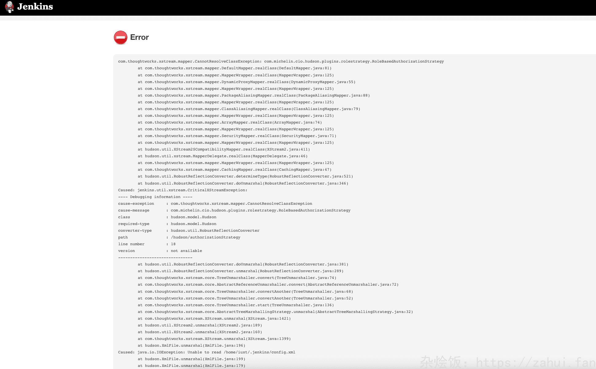

## Jenkins升级
### 替换镜像
直接替换高版本jenkins容器后，console会报权限插件错误 



### 修改config.xml
1. 备份config.xml
2. 修改authorizationStrategy标签
```xml
<authorizationStrategy class="hudson.security.FullControlOnceLoggedInAuthorizationStrategy">
    <denyAnonymousReadAccess>false</denyAnonymousReadAccess>
</authorizationStrategy>
```
在网上看有个教程需要删除securityRealm标签块，我没有删除，依然正常进入。
### 更新插件
1. 用原账号密码登录进jenkins
2. 系统管理->插件管理->Advanced settings,修改升级站点
https://mirrors.huaweicloud.com/jenkins/updates/dynamic-stable-2.462.1/update-center.json
3. 更新插件
4. 重启还原配置

## jenkins权限配置错误导致登录403、页面空白或者UI只展示报错页面
找到jenkins的config.xml文件
1. ```<authorizationStrategy class="hudson.security.AuthorizationStrategy$Unsecured"/>```
这个权限对应"任何用户可以做任何事(没有任何限制)"
2. ```<authorizationStrategy class="hudson.security.FullControlOnceLoggedInAuthorizationStrategy"/>```
这个权限对应"登录用户可以做任何事"
3. ```<authorizationStrategy class="hudson.security.GlobalMatrixAuthorizationStrategy">
    <permission>hudson.model.Hudson.Administer:test</permission>
    <permission>hudson.scm.SCM.Tag:test</permission>
  </authorizationStrategy>```
这个权限对应 test用户可以是管理员、打标签权限。
