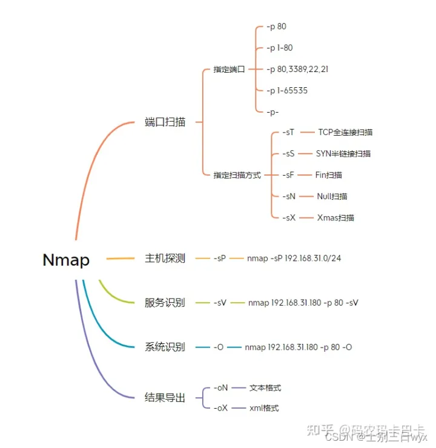
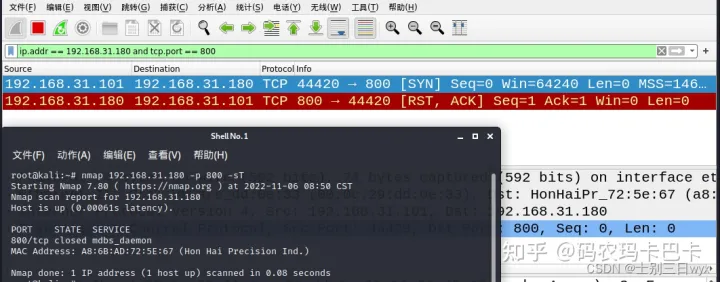
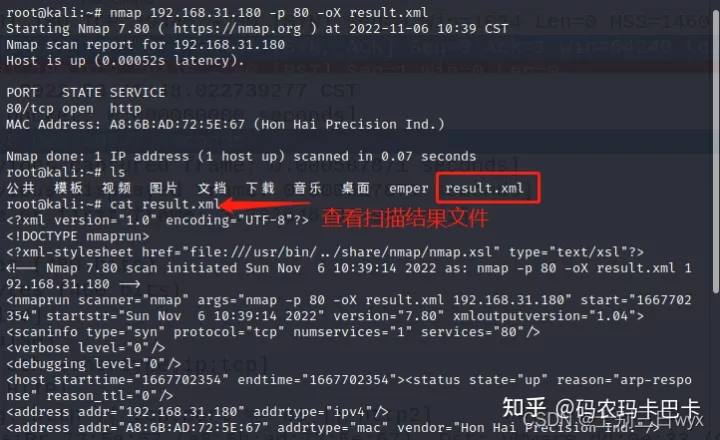

## 总览  


## 端口扫描
扫描主机的「开放端口」，在nmap后面直接跟主机IP（默认扫描1000个端口）。「指定端口」，使用 -p 参数，可以一次扫描单个端口、多个端口、或扫描一个范围的端口
```bash
nmap 192.168.31.180

nmap 192.168.31.180 -p 80
nmap 192.168.31.180 -p 1-80
nmap 192.168.31.180 -p 80,3389,22,21
nmap 192.168.31.180 -p 1-65535
nmap 192.168.31.180 -p-    # -p- 等价于 -p 1-65535
```
## TCP全连接扫描
使用 `-sT` 参数进行TCP全连接扫描。
「全连接扫描」使用完整的三次握手建立链接，能够建立链接就判定端口开放，否则判定端口关闭。
```bash
nmap 192.168.31.180 -p 80 -sT
```
1. 如果端口开放，就会进行完整的三次握手，成功建立链接，扫描结果中，STATE字段显示为 open


2. 如果端口关闭，就只能进行一次握手，无法建立链接，扫描结果中，STATE字段显示为 closed


## SYN半链接扫描
使用 `-sS` 参数进行SYN半链接扫描。
「半链接扫描」只进行两次握手，对方返回确认帧（ACK=1）就判定端口开放，否则判定端口关闭。
```bash
nmap 192.168.31.180 -p 80 -sS
```
1. 如果端口开放，就会进行两次握手，扫描结果中，STATE字段为 open


2. 如果端口关闭，就只有一次握手，扫描结果中，STATE字段为 closed


## 隐秘扫描
>隐秘扫描，只适用于Linux系统  
「隐秘扫描」向目标主机的端口发送TCP FIN包 或 Xmas tree包 或 Null包，如果收到RST响应包，就判定端口关闭，否则就判定端口开放或被屏蔽（open/filtered）
```bash
nmap 127.0.0.1 -p 80 -sF  # Fin扫描
nmap 127.0.0.1 -p 80 -sN  # Null扫描（所有flags都为0的TCP包）
nmap 127.0.0.1 -p 80 -sX  # Xmas扫描（flags的FIN、URG、PUSH都为1的包）
```

## 主机探测
扫描网段中有哪些主机在线，使用 -sP 参数，不扫描端口，只扫描「存活主机」。
本质上是Ping扫描，能Ping通有回包，就判定主机在线。
```bash
nmap -sP 192.168.31.0/24
```
从上图可以看到：它用2秒扫描了这个网段的256个IP，其中有3个存活主机，效率还是蛮不错的。

## 服务识别
扫描端口时，默认显示端口对应的服务，但不显示服务版本。
想要识别具体的「服务版本」，可以使用 -sV 参数。
```bash
nmap 192.168.31.180 -p 80 -sV
```


## 系统识别
想要识别「操作系统版本」，可以使用 -O 参数。
```bash
nmap 192.168.31.180 -p 80 -O
```
::: info 提示
1.Nmap扫描出的系统版本并完全准确，仅供参考。
2.当识别不出具体版本时，Nmap会以概率的形式列举出可能的操作系统，如上图所示。
:::

## 扫描结果导出
Nmap的扫描结果可以保存到文件中，比如文本格式、XML格式。
### 将扫描结果导出为「文本格式」，结果原样保存
```bash
nmap 192.168.31.180 -p 80 -oN result.txt
```
