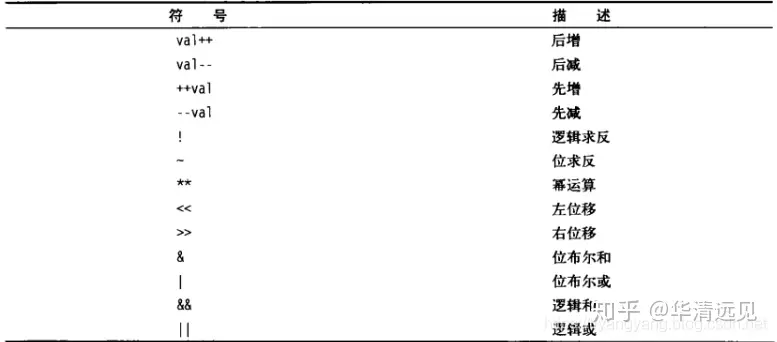

## 注释
"#" 开头的就是注释，被编译器忽略
- 单行注释: #
- 多行注释: :<

## 变量

### 变量类型
运行shell时，会同时存在三种变量:
1. 局部变量:局部变量在脚本或命令中定义，仅在当前shell实例中有效，其他shell启动的程序不能访问局部变量。
2. 环境变量:所有的程序，包括shell启动的程序，都能访问环境变量，有些程序需要环境变量来保证其正常运行。必要的时候shell脚本也可以定义环境变量。
3. shell变量:shell变量是由shell程序设置的特殊变量。shell变量中有一部分是环境变量，有一部分是局部变量，这些变量保证了shell的正常运行

### 变量操作
- 创建普通变量: name="test" （=两边不可有空格）
- 创建只可函数体中使用的局部变量: local name="test" （使用local修饰的变量在函数体外无法访问，并且local只能在函数体内使用）
- 使用变量: echo $name 或者 echo ${name} （推荐使用大括号版）
- 变量重新赋值: name="new_test" （将原值覆盖）
- 只读变量: name="only_read" -> readonly name （使用readonly标识后的变量，不可被修改）
- 删除变量: unset name; （删除之后不可访问，删除不掉只读变量）

### 字符串变量

### 单引号
- 单引号变量var='test' ，只能原样输出，变量无效
- 单引号中不能出现一个单独的单引号，转义也不可以
### 双引号
- 双引号变量var="my name is ${name}"，变量有效
- 可出现转义符
### 拼接字符串
- 中间无任何+，之类的字符
- ```name="this is"" my name";``` ```name="this is my name";``` ```name="this" is "my name"``` 等效
- ```name='this is'' my nam';``` ```name='this is my name';``` ```name='this' is 'my name'``` 等效

### 获取字符串长度
- 在${}中使用“#”获取长度
- ```name="test";```
- ```echo ${#name};``` # 输出为4

### 提取子字符串
- 1:4 从第2个开始 往后截取4个字符
- ::4 从第一个字符开始 往后截取4个字符
- ```name="this is my name";```
- ```echo ${name:1:4}``` #输出 is i
- ```echo ${name::4}``` #输出 this

## 数组
bash只支持一维数组，不支持多维数组
- 定义数组:```array_name=(li wang xiang zhang)``` （小括号做边界、使用空格分离）
- 单独定义数组的元素: ```array_para[0]="w"; array_para[3]="s"``` （定义时下标不连续也可以）
- 赋值数组元素:```array_name[0]="zhao";```
- 获取数组元素:
  - ```array_name[0]="li"```
  - ```array_name[3]="zhang"```
  - ```echo ${array_name[0]}``` # 输出"li"
  - ```echo ${array_name[1]}``` # 输出" "
  - ```echo ${array_name[3]}``` # 输出"zhang"
  - ```echo ${array_name[@]}``` # 输出"li zhang" 输出数组所有元素，没有元素的下标省略

- 取得元素个数:```${#array_name[@]}```或者```${#array_name}```
- 取得单个元素长度:${#array_name[1]}
- 取得元素个数:```${#array_name[@]}```或者```${#array_name}```
- 取得单个元素长度:```${#array_name[1]}```

## 参数传递
- 获取参数值:
  - $0 : 固定，代表执行的文件名
  - $1 : 代表传入的第1个参数
  - $n : 代表传入的第n个参数3
- \$#:参数个数
- \$*: 以一个单字符串显示所有向脚本传递的参数。如"$*"用「"」括起来的情况、以"$1 $2 … $n"的形式输出所有参数
- \$@:与$*相同，但是使用时加引号，并在引号中返回每个参数。
- \$\$:脚本运行的当前进程号
- \$！:后台运行的最后一个进程的ID
- \$?: 显示最后命令的退出状态。0表示没有错误，其他任何值表明有错误。
- \$* 与 $@ 区别
  - 相同点:都是引用所有参数。
  - 不同点:只有在双引号中体现出来。假设在脚本运行时写了三个参数 1、2、3，，则 " * " 等价于 "1 2 3"（传递了一个参数），而 "@" 等价于 "1" "2" "3"（传递了三个参数）。

## 运算符
### 算数运算
- + 、-、*、\ : 乘号前必须加\进行转义才可以进行乘法运算
- 加法运算
  - ``` val=`expr 2 + 2` ``` （使用linux命令expr进行辅助运算）
  - ```val=$[2+2]``` （4个空格不是必要的，不同于条件判断）
  - ```val=$((2+2))```

### 数字关系运算符
关系运算符只支持数字，不支持字符串，除非字符串的值是数字。
下面假定变量 a 为 10，变量 b 为 20
- -eq :检测两个数是否相等，相等返回 true。 ```[ $a -eq $b ]``` 返回 false。
- -ne: 检测两个数是否不相等，不相等返回 true。 ```[ $a -ne $b ]``` 返回 true。
- -gt: 检测左边的数是否大于右边的，如果是，则返回 true。 ```[ $a -gt $b ]``` 返回 false。
- -lt : 检测左边的数是否小于右边的，如果是，则返回 true。 ```[ $a -lt $b ]``` 返回 true。
- -ge: 检测左边的数是否大于等于右边的，如果是，则返回 true。 ```[ $a -ge $b ]``` 返回 false。
- -le : 检测左边的数是否小于等于右边的，如果是，则返回 true。 ```[ $a -le $b ]``` 返回 true。

### 字符串运算符
下表列出了常用的字符串运算符，假定变量 a 为 "abc"，变量 b 为 "efg":
- = :检测两个字符串是否相等，相等返回 true。 ```[ $a = $b ]``` 返回 false。
- != :检测两个字符串是否相等，不相等返回 true。 ```[ $a != $b ]``` 返回 true。
- -z :检测字符串长度是否为0，为0返回 true。 ```[ -z $a ]``` 返回 false。
- -n :检测字符串长度是否为0，不为0返回 true。 ```[ -n "$a" ]``` 返回 true。
- $ :检测字符串是否为空，不为空返回 true。 ```[ $a ]``` 返回 true。

### 布尔运算符
下表列出了常用的布尔运算符，假定变量 a 为 10，变量 b 为 20:
- ! :非运算，表达式为 true 则返回 false，否则返回 true。 ```[ ! false ]``` 返回 true。
- -o :或运算，有一个表达式为 true 则返回 true。 ```[ $a -lt 20 -o $b -gt 100 ]``` 返回 true。
- -a :与运算，两个表达式都为 true 才返回 true。 ```[ $a -lt 20 -a $b -gt 100 ]``` 返回 false。

### 逻辑运算符
以下介绍 Shell 的逻辑运算符，假定变量 a 为 10，变量 b 为 20:
- && :逻辑的 AND。 ```[[ $a -lt 100 && $b -gt 100 ]]``` 返回 false
- || :逻辑的 OR。 ```[[ $a -lt 100 || $b -gt 100 ]]``` 返回 true

### 文件运算符
- -b file :检测文件是否是块设备文件，如果是，则返回 true。 ```[ -b $file ]``` 返回 false。
- -c file :检测文件是否是字符设备文件，如果是，则返回 true。 ```[ -c $file ]``` 返回 false。
- -d file :检测文件是否是目录，如果是，则返回 true。 ```[ -d $file ]``` 返回 false。
- -f file :检测文件是否是普通文件（既不是目录，也不是设备文件），如果是，则返回 true。 ```[ -f $file ]``` 返回 true。
- -g file :检测文件是否设置了 SGID 位，如果是，则返回 true。 ```[ -g $file ]``` 返回 false。
- -k file :检测文件是否设置了粘着位(Sticky Bit)，如果是，则返回 true。 ```[ -k $file ]``` 返回 false。
- -p file :检测文件是否是有名管道，如果是，则返回 true。 ```[ -p $file ]``` 返回 false。
- -u file :检测文件是否设置了 SUID 位，如果是，则返回 true。 ```[ -u $file ]``` 返回 false。
- -r file :检测文件是否可读，如果是，则返回 true。 ```[ -r $file ]``` 返回 true。
- -w file :检测文件是否可写，如果是，则返回 true。 ```[ -w $file ]``` 返回 true。
- -x file :检测文件是否可执行，如果是，则返回 true。 ```[ -x $file ]``` 返回 true。
- -s file :检测文件是否为空（文件大小是否大于0），不为空返回 true。 ```[ -s $file ]``` 返回 true。
- -e file :检测文件（包括目录）是否存在，如果是，则返回 true。 ```[ -e $file ]``` 返回 true。

## 执行相关
### 命令替换
命令替换与变量替换差不多，都是用来重组命令行的，先完成引号里的命令行，然后将其结果替换出来，再重组成新的命令行。
执行命令:
1. ``` `ls /etc` ``` : 反引号 （所有的unix系统都支持）
2. `$(ls /etc)` : $+() （部分unix系统不支持）  

多个嵌套使用时，从内向外执行`for file in \s /etc\` 或 `for file in $(ls /etc)`循环中使用

```path=$(cd `dirname $0`;pwd)``` : 获取脚本当前所在目录，并且执行cd命令到达该目录，使用pwd获取路径并赋值到path变量

### 算术运算
1.$[ ] : 加减乘除,不必添加空格  
2.$(( )) :加减乘除等,不必添加空格
### 逻辑判断
1.[ ] : 中括号旁边和运算符两边必须添加空格 （可以使用，不推荐）  

2.[[ ]]:中括号旁边和运算符两边必须添加空格 （字符串验证时，推荐使用）  

3.(()) : 中括号旁边和运算符两边必须添加空格 （数字验证时，推荐使用）  

4.[[]] 和 (()) 分别是[ ]的针对数学比较表达式和字符串表达式的加强版。  

5.使用[[ ... ]]条件判断结构，而不是[ ... ]，能够防止脚本中的许多逻辑错误。比如，&&、||、<和> 操作符能够正常存在于[[ ]]条件判断结构中，但是如果出现在[ ]结构中的话，会报错。比如可以直接使用if [[ $a != 1 && $a != 2 ]], 如果不适用双括号, 则为if [ $a -ne 1] && [ $a != 2 ]或者if [ $a -ne 1 -a $a != 2 ]。  

[[ ]]中增加模式匹配特效；

(( ))不需要再将表达式里面的大小于符号转义，除了可以使用标准的数学运算符外，还增加了以下符号


## 输出
### echo
仅用于字符串的输出，没有使用printf作为输出的移植性好，建议使用printf
### printf
>printf 不会像 echo 自动添加换行符，我们可以手动添加 \n无大括号，直接以空格分隔

- 格式:printf format-string [arguments...] 其中（format-string: 格式控制字符串、arguments: 参数列表）
- 案例:printf "%-10s %-8s %-4.2f\n" 郭靖 男 66.1234
- %s %c %d %f 都是格式替代符
  - d:Decimal 十进制整数 对应位置参数必须是十进制整数，否则报错!
  - s:String 字符串 对应位置参数必须是字符串或者字符型 否则报错
  - c:Char 字符 对应位置参数必须是字符串或者字符型 否则报错
  - f:Float 浮点 对应位置参数必须是数字型 否则报错
- %-10s ： 指一个宽度为10个字符（-表示左对齐，没有则表示右对齐），任何字符都会被显示在10个字符宽的字符内，如果不足则自动以空格填充，超过也会将内容全部显示出来。
- %-4.2f ：指格式化为小数，宽度为4个字符，其中.2指保留2位小数。
- 转义符：
  - \a ：警告字符，通常为ASCII的BEL字符
  - \b ：后退
  - \c ：抑制（不显示）输出结果中任何结尾的换行字符（只在%b格式指示符控制下的参数字符串中有效），而且，任何留在参数里的字符、任何接下来的参数以及任何留在格式字符串中的字符，都被忽略
  - \f ：换页（formfeed）
  - \n ：换行
  - \r ：回车（Carriage return）
  - \t ：水平制表符
  - \v ：垂直制表符
  - \ ：一个字面上的反斜杠字符
  - \ddd ：表示1到3位数八进制值的字符。仅在格式字符串中有效
  - \0ddd ：表示1到3位的八进制值字符

## 重定向
1. 一般情况下，每个 Unix/Linux 命令运行时都会打开三个文件：
   - **标准输入文件(stdin)**：stdin的文件描述符为0，Unix程序默认从stdin读取数据。
   - **标准输出文件(stdout)**：stdout 的文件描述符为1，Unix程序默认向stdout输出数据。
   - **标准错误文件(stderr)**：stderr的文件描述符为2，Unix程序会向stderr流中写入错误信息。
  
2. 默认情况下，command > file 将 stdout 重定向到 file，command < file 将stdin 重定向到 file。
   
3. 如果希望执行某个命令，但又不希望在屏幕上显示输出结果，那么可以将输出重定向到 /dev/null

### 输入重定向
1. bash.sh < file ： 将脚本的输入重定向到file，由file提供参数
   
### 输出重定向
1. bash.sh > file ： 将脚本的输出数据重定向到file中，覆盖数据

2. bash.sh >> file ： 将脚本的输出数据重定向到file中，追加数据

3. command >> file 2>&1 ： 将 stdout 和 stderr 合并后重定向到 file

### 读取外部输入
```bash
read arg #脚本读取外部输入并赋值到变量上
```
在shell脚本执行到上述命令时，停止脚本执行并等待外部输入，将外部输入赋值到arg变量上，继续执行脚本。

### 文件引用
引用其他的文件之后，可以使用其变量、函数等等，相当于将引用的文件包含进了当前文件

- **.**  file_path/file_name
- **source** file_path/file_name

### 颜色标识
```shell
printf "\033[32m SUCCESS: yay \033[0m\n";
printf "\033[33m WARNING: hmm \033[0m\n";
printf "\033[31m ERROR: fubar \033[0m\n";
```
输出结果：


## shell脚本调试
>在绝大多数 shell 脚本中，exit 0 表示执行成功，exit 1 表示发生错误。对错误与错误码进行一对一的映射，这样有助于脚本调试。
### 错误退出
**set**：set -e 或者 set +e  
`set -e`表示从当前位置开始，如果出现任何错误都将触发exit。相反，set +e表示不管出现任何错误继续执行脚本。  

> 如果脚本是有状态的（每个后续步骤都依赖前一个步骤），那么请使用set -e，在脚本出现错误时立即退出脚本。如果要求所有命令都要执行完（很少会这样），那么就使用set +e。  
### 语法检测
检查是否有语法错误：`bash -n script_name.sh`  
### 调试
查看脚本每一步输出：`bash -x script_name.sh`
>输出中带有 + 表示的是 Shell 调试器的输出，不带 + 表示程序的输出。