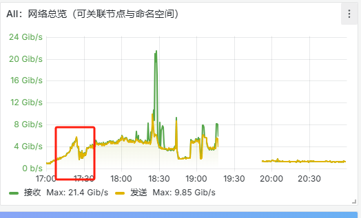
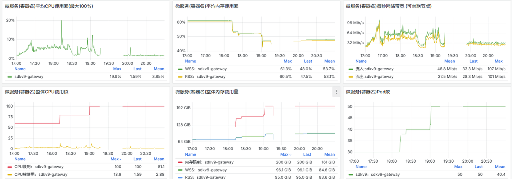
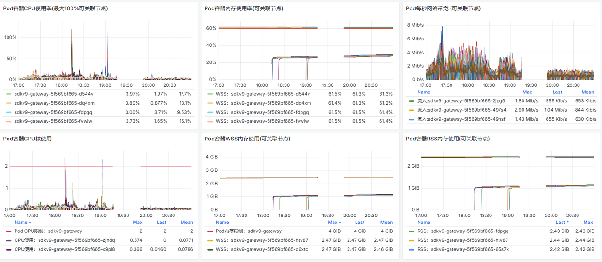
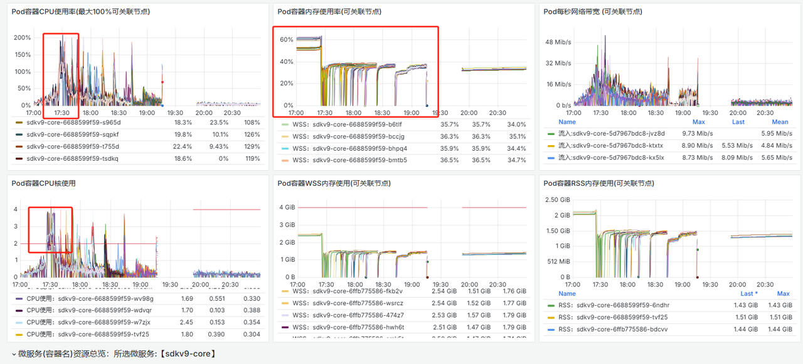
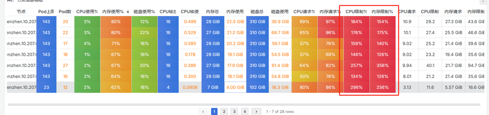

## 事故概述
一个内部项目17点更新停服重启，停服开服运营没有做事先通知，大量用户下线在重新登录，瞬间流量超过平时4倍。

## 事件分析
### 大量流量进入sdkv9-gateway服务
  

由 gateway服务整体资源图 和 gateway服务pod详细资源图 可以得出：
1. gateway的cpu和内存资源充足
2. gateway服务扩容前抗住了流量压力
3. 在18点10分的附近好像做个gateway的deployment改动操作，造成了2个左右容器的cpu使用率过高。
 
 

### 流量转发至sdkv9-core服务
由 sdkv9-core服务整体资源图 和 sdkv9-core服务pod详细资源图 可以得出：
1. 从整体资源图上看引起事故发生的第一原因是pod的cpu资源不够
2. 在事故发生时已经将cpu资源做了扩容，此时cpu资源已经够用。17：40-17：46 短暂性的服务正常了，此时好像通知其他同事服务正常了
3. 用户又开始登录了，在整体资源够用的情况下，扩容后的服务开始出现断断续续的NotReady，pod的cpu资源使用率持续性的飙升，这时候又做了二次扩容，三次扩容，四次扩容，四次扩容服务依然没有完全恢复。
4. 18：10 进行事故第三次分析，发现单pod总是突破cpu上限，决定提高cpu的限制由2提高到3，但是突破了节点资源，部分pod无法启动，又由3赶紧调回2。再次分析面板锁定是健康检查机制导致的pod间歇性不可用，退而求其次移除健康检测机制，18:20左右服务阶段性正常。
5. 18：20-18：50期间尝试性的调整过几次服务，把健康检查机制加回来，从监控中发现流量大的情况调整服务会引发流量波峰，会短暂出现NotReady，可能会引发服务雪崩（sdkv9-ip在此过程中崩过）。
 
 
 

### 其他服务
1. 由于第一时间把流量大的其他服务（比如ws）也扩容了，所以其他没有产生较大的影响，这块算是一个经验缺失。
2. 在后期cpu加的过多导致监控采集模块服务挂掉，这块和集群整体资源限制规划有关。在之前忽略了这块会引发的连锁反应。
 
