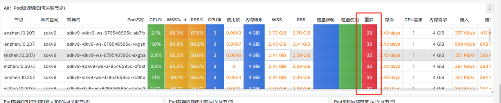
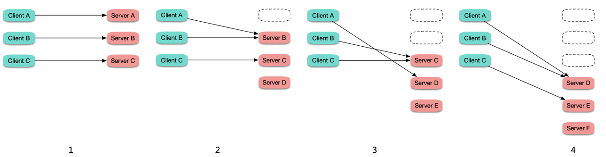
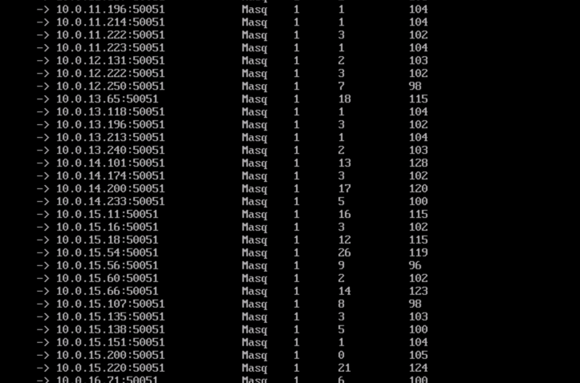

# 现场
 

# 起因
瞬时流量激增（日常2倍）

# 事件原因
核心问题就是k8s集群的滚动更新机制和流量轮询策略导致sdkv9-ws上的连接数不均衡导致oom。
# 负载不均问题
对于长连接的服务，可能会存在负载不均的问题，下面介绍两种场景。
## 滚动更新负载不均
在连接数比较固定或波动不大的情况下，滚动更新时，旧 Pod 上的连接逐渐断掉，重连到新启动的 Pod 上，越先启动的 Pod 所接收到的连接数越多，造成负载不均。
 
## rr 策略负载不均
假如长连接服务的不同连接的保持时长差异很大，而 ipvs 转发时默认是 rr 策略转发，如果某些后端 Pod "运气较差"，它们上面的连接保持时间比较较长，而由于是 rr 转发，它们身上累计的连接数就可能较多，节点上通过 ipvsadm -Ln -t CLUSTER-IP:PORT 查看某个 service 的转发情况:
 
部分 Pod 连接数高，意味着相比连接数低的 Pod 要同时处理更多的连接，着消耗的资源也就相对更多，从而造成负载不均。

# 解决方案
通过扩容2个ws容器完成修复
# 参考
[长连接服务](https://imroc.cc/kubernetes/best-practices/long-connection) 
