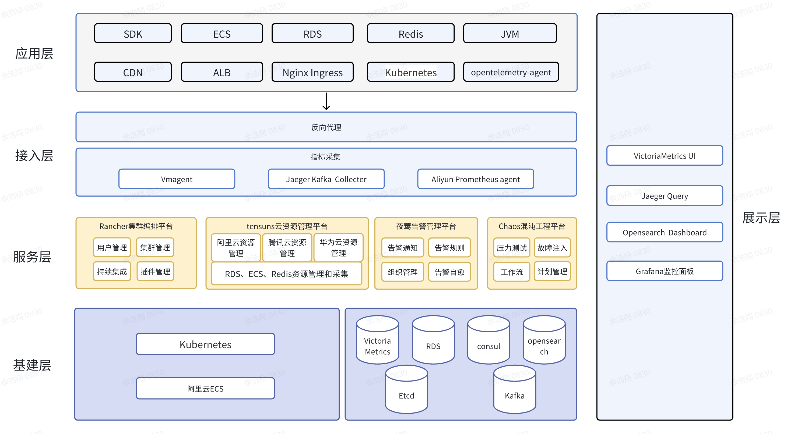
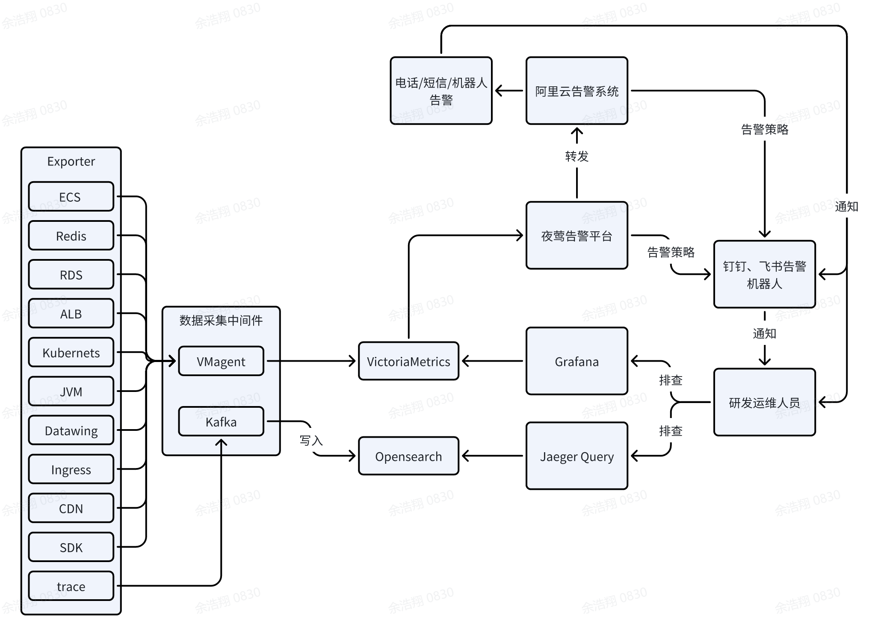

## 监控流量流向
  
## 组件说明
### 接入层
**Vmagent**：根据配置的规则去采集指标，并上报到VictoriaMertrics  
**Jaeger Kafka Collecter**：采集应用请求链路信息，并写入kafka  
**Aliyun Prometheus agent**：采集阿里云产品的指标，并上报到VictoriaMertrics  
### 服务层
**Rancher集群管理平台**：聚合企业网下面的集群平台  
**Tensuns云资源管理平台**：聚合阿里云、腾讯云 和华为云下的ECS、RDS、Redis，并统一管理监控指标采集配置  
**夜莺告警管理平台**：配置告警规则，配置告警转发、配置告警自愈、管理业务组和人员  
**Chaos混沌工程平台**：故障注入平台，具有块存储故障、HTTP 故障、网络攻击、内核故障、压力测试、Pod 故障、JVM故障等等  
### 基建层
**ECS**：部署Kubernets集群  
**Kubernets**：容器编排平台，部署各个服务  
**VictoriaMetrics**：时序数据库，存储监控指标  
**RDS**：MySQL，存储平台配置  
**Consul**：KV缓存，保存Tensuns平台账号配置和资源信息  
**Opensearch**：基于ES的开源全文检索平台。目前存储请求链路数据  
**Etcd**：存储Kubernets集群状态  
**Kafka**：作为请求链路数据的存储中间件

## 告警路径

