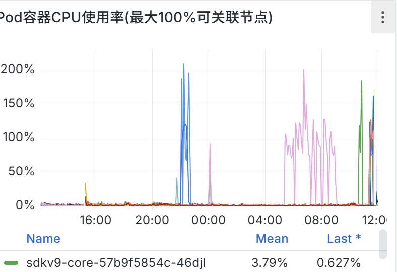
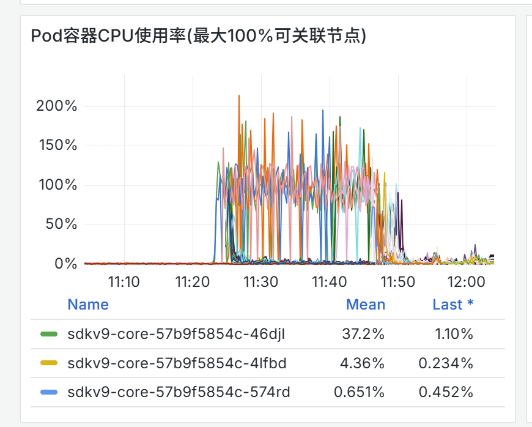
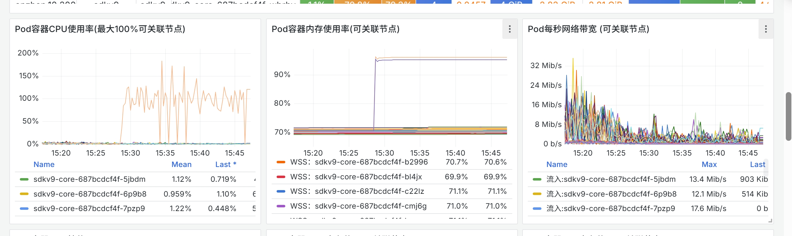
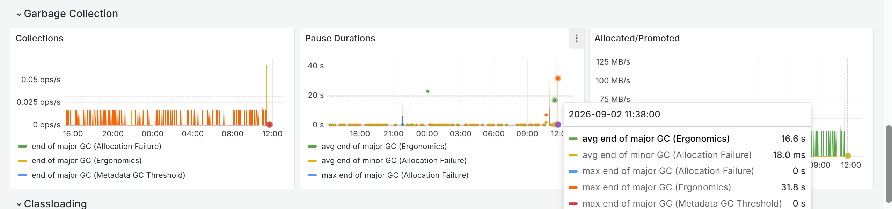
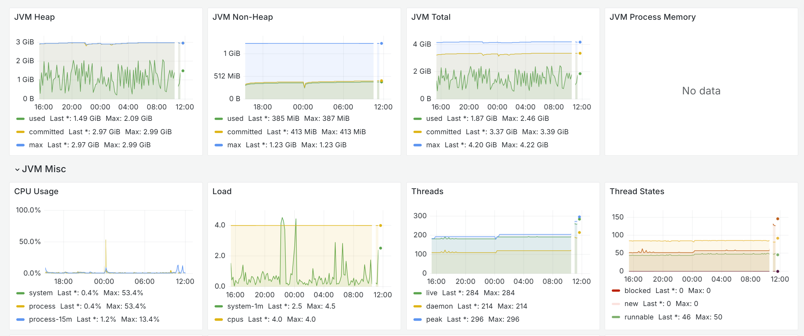
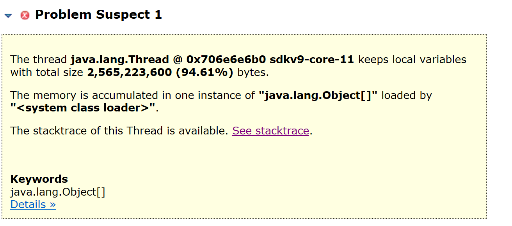
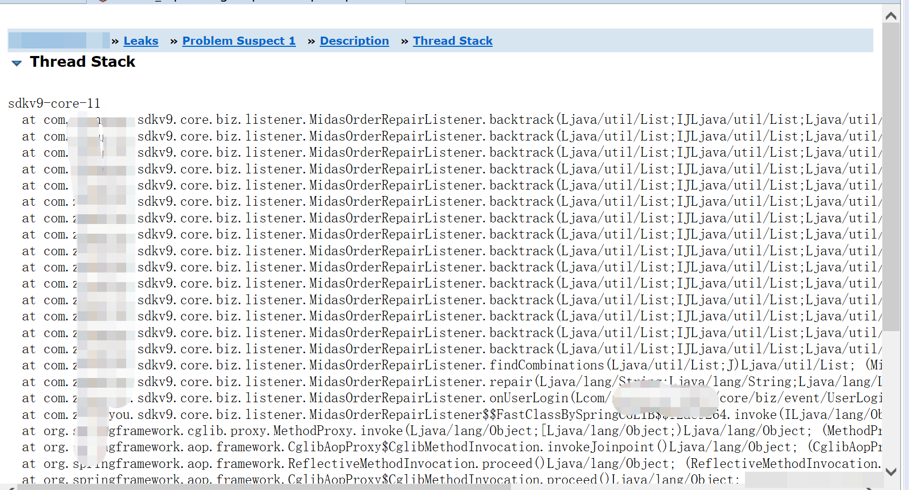

## 现象
sdk服务共有20个pod，总是有一两个pod cpu使用率很高，然后进入not ready状态，过段时间oom后重启。

## 监控

  
  
  
  

## 排查思路
&ensp;&ensp;&ensp;&ensp;首先，我根据10%的pod才出现的问题可以断定和业务代码有关，因为发生问题肯定是需要特殊的条件且同一台机器有好的pod也有有问题的pod，其次根据jvm gc延迟偶然很高的情况感觉有伴随性的内存泄露。但是不了解具体的业务代码无法继续排查，遂告知研发，研发反馈是网络问题，线上没异常不继续排查。
2. 立即决定自己去排查jvm，导出jvm的堆栈信息。
  
一个线程占了94%的内存,继续去查看内部细节
  
在找到相应代码，是一个递归。找到研发核对，研发反馈是某一个用户的数据量太大。修改递归代码后问题解决。